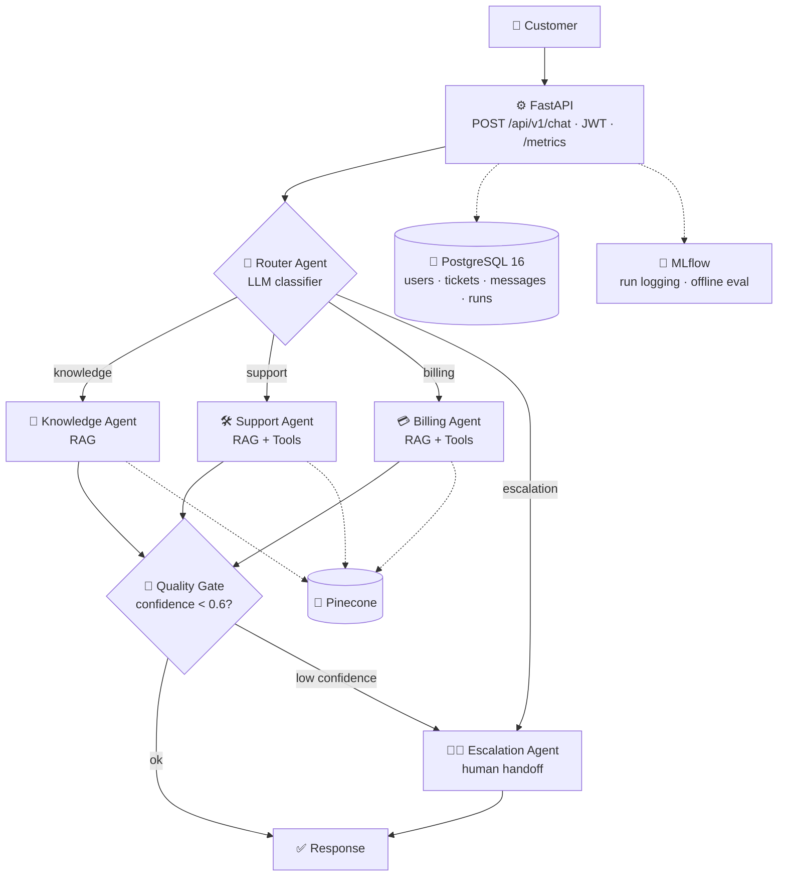
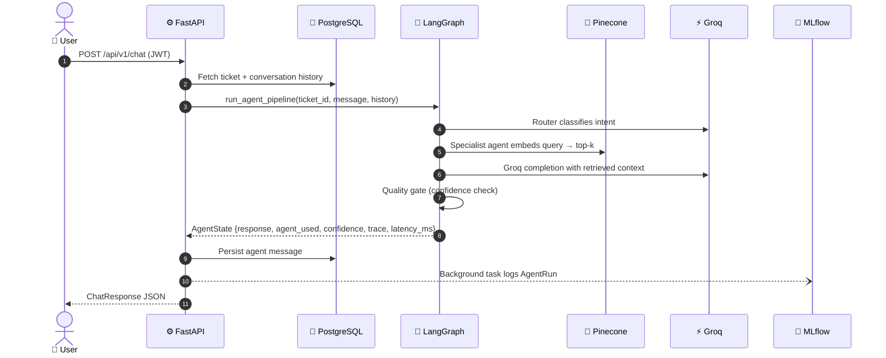
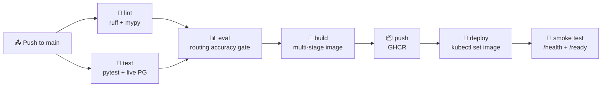

<div align="center">

# 🤖 AI Customer Support Agent Platform

### 🚀 Enterprise-grade **multi-agent** customer support: RAG + Agentic AI + MLOps + Production Infra

[](https://github.com/your-org/ai-support-platform/actions/workflows/ci-cd.yml)
[](https://www.python.org/downloads/)
[](https://fastapi.tiangolo.com)
[](https://langchain-ai.github.io/langgraph/)


[](LICENSE)

**💬 Customer message → 🧭 Router → 🤖 Specialist agent (RAG + tools) → ✅ Quality gate → 🧑‍💼 Human escalation if needed**

</div>

---

A full-stack AI platform that handles customer support end-to-end: a **LangGraph multi-agent pipeline** routes, answers, and escalates queries using **RAG over Pinecone**, grounded by **Groq-hosted LLMs**, tracked with **MLflow**, and deployed to **Kubernetes** via a complete **GitHub Actions CI/CD** pipeline.

## 📚 Table of Contents
1. [✨ Features](#-features)
2. [🏗️ Architecture](#️-architecture)
3. [🔄 Request Lifecycle](#-request-lifecycle)
4. [🧰 Tech Stack](#-tech-stack)
5. [📁 Project Structure](#-project-structure)
6. [⚡ Quick Start](#-quick-start-local)
7. [🔌 Key API Endpoints](#-key-api-endpoints)
8. [📊 MLOps: Offline Evaluation](#-mlops--offline-evaluation)
9. [🚦 CI/CD Pipeline](#-cicd-pipeline)
10. [☸️ Kubernetes](#️-kubernetes)
11. [🔑 Required Secrets](#-required-secrets)
12. [🗺️ Roadmap](#️-roadmap)
13. [🛟 Troubleshooting](#-troubleshooting)
14. [📄 License](#-license)

---

## ✨ Features

| | Feature | Description |
|---|---|---|
| 🧭 | **LLM router** | Classifies each message into `knowledge`, `support`, `billing` or `escalation` |
| 📖 | **Knowledge agent** | RAG question answering over Pinecone |
| 🛠️ | **Support agent** | Technical troubleshooting using RAG plus tool calls |
| 💳 | **Billing agent** | Billing and refund handling using RAG plus tool calls |
| 🚨 | **Quality gate** | Auto-escalates to a human when confidence is below 0.6 |
| 🧑‍💼 | **Escalation agent** | Human handoff |
| 🎫 | **Tickets & history** | Users, tickets and conversations stored in PostgreSQL |
| 🔐 | **Auth** | JWT with bcrypt password hashing |
| 📊 | **MLOps** | Every agent run logged to MLflow, plus an offline golden-dataset evaluation |
| 📈 | **Observability** | Structured JSON logs (structlog), Prometheus `/metrics`, Grafana |
| 🚢 | **Production infra** | Multi-stage Docker, docker-compose, Kubernetes with HPA, GitHub Actions |

---

## 🏗️ Architecture



<details>
<summary>📟 ASCII version</summary>

```
                     ┌─────────────────────────────────────────────┐
                     │            FastAPI Application               │
                     │  POST /api/v1/chat · JWT Auth · /metrics     │
                     └─────────────────────┬───────────────────────┘
                                           │
                     ┌─────────────────────▼───────────────────────┐
                     │          LangGraph State Machine             │
                     │                                              │
                     │   ┌──────────────────────────────────────┐  │
                     │   │           Router Agent               │  │
                     │   │  (LLM classifier → JSON route)       │  │
                     │   └────┬──────────┬───────────┬──────────┘  │
                     │        │          │           │             │
                     │   ┌────▼──┐  ┌───▼───┐  ┌───▼────┐        │
                     │   │Knowl- │  │Support│  │Billing │        │
                     │   │edge   │  │Agent  │  │Agent   │        │
                     │   │Agent  │  │RAG +  │  │RAG +   │        │
                     │   │(RAG)  │  │Tools  │  │Tools   │        │
                     │   └────┬──┘  └───┬───┘  └───┬────┘        │
                     │        └──────────┴──────────┘             │
                     │                  │                          │
                     │        ┌─────────▼──────────┐              │
                     │        │    Quality Gate     │              │
                     │        │  confidence < 0.6?  │              │
                     │        └─────────┬───────────┘              │
                     │           ok ▼       ▼ low conf             │
                     │          [END]  ┌────▼────────┐             │
                     │                 │ Escalation  │             │
                     │                 │   Agent     │             │
                     │                 │(human handoff)│           │
                     │                 └─────────────┘             │
                     └─────────────────────────────────────────────┘
                                           │
     ┌─────────────────────────────────────┼──────────────────────────────────┐
     │                                     │                                  │
┌────▼───────────────┐         ┌───────────▼──────────┐          ┌───────────▼──────┐
│   PostgreSQL 16    │         │  Pinecone (Vector DB) │          │  MLflow Tracking │
│  Users · Tickets   │         │  RAG Retrieval        │          │  Run logging     │
│  Messages · Runs   │         │  all-MiniLM-L6-v2     │          │  Offline eval    │
└────────────────────┘         └──────────────────────┘          └──────────────────┘
```
</details>

---

## 🔄 Request Lifecycle



<details>
<summary>📟 Text version</summary>

```
User → POST /api/v1/chat
  │
  ├─ JWT auth (deps.py)
  ├─ Fetch ticket + conversation history (PostgreSQL)
  ├─ run_agent_pipeline(ticket_id, message, history)
  │    ├─ Router classifies intent → route ∈ {knowledge, support, billing, escalation}
  │    ├─ Specialist agent: embed query → Pinecone top-k → Groq completion
  │    ├─ Quality gate: confidence check → auto-escalate if low
  │    └─ Returns AgentState {response, agent_used, confidence, trace, latency_ms}
  ├─ Persist agent message to conversation (PostgreSQL)
  ├─ Background task: log AgentRun to MLflow
  └─ Return ChatResponse JSON
```
</details>

---

## 🧰 Tech Stack

| Layer | Technology |
|---|---|
| ⚙️ **API** | FastAPI 0.115, Pydantic v2, Uvicorn |
| 🤖 **Agentic AI** | LangGraph 0.2 (state machine), LangChain 0.3 |
| ⚡ **LLM** | Groq (`openai/gpt-oss-120b`, fallback `openai/gpt-oss-20b`) |
| 🌲 **Vector DB** | Pinecone (serverless) |
| 🔢 **Embeddings** | sentence-transformers `all-MiniLM-L6-v2` (384-dim) |
| 🐘 **Database** | PostgreSQL 16 + SQLAlchemy 2.0 |
| 🧪 **MLOps** | MLflow 2.17: run tracking, offline eval, prompt versioning |
| 📈 **Observability** | structlog (structured JSON logs), Prometheus `/metrics`, Grafana |
| 🔐 **Auth** | JWT (python-jose) + bcrypt password hashing |
| 🐳 **Containerisation** | Docker (multi-stage build), docker-compose |
| ☸️ **Orchestration** | Kubernetes: Deployment, Service, ConfigMap, Secret, HPA, Ingress |
| 🔄 **CI/CD** | GitHub Actions: lint → test → eval gate → build → push → deploy |

---

## 📁 Project Structure

```
ai-support-platform/
├── 🤖 app/
│   ├── agents/                 # LangGraph multi-agent system
│   │   ├── state.py            #   shared TypedDict graph state
│   │   ├── orchestrator.py     #   graph wiring + entry point
│   │   ├── router_agent.py     #   LLM intent classifier
│   │   ├── knowledge_agent.py  #   RAG Q&A
│   │   ├── support_agent.py    #   technical troubleshooting + tools
│   │   ├── billing_agent.py    #   billing/refunds + tools
│   │   ├── escalation_agent.py #   human handoff
│   │   ├── quality_gate.py     #   auto-escalation on low confidence
│   │   └── tools.py            #   simulated business tool calls
│   ├── api/                    # FastAPI routers
│   │   ├── auth_routes.py      #   register / login
│   │   ├── chat_routes.py      #   POST /chat: main agent endpoint
│   │   ├── ticket_routes.py    #   CRUD tickets
│   │   ├── kb_routes.py        #   knowledge-base ingestion (admin)
│   │   ├── health_routes.py    #   /health /ready (K8s probes)
│   │   └── deps.py             #   JWT auth dependency
│   ├── core/                   # config, logging, security
│   ├── db/                     # SQLAlchemy models + session
│   ├── rag/                    # embeddings, chunking, Pinecone, retriever
│   ├── schemas/                # Pydantic request/response models
│   └── services/               # LLM client, MLflow logger, eval, prompt registry
├── ☸️ k8s/
│   ├── namespace.yaml
│   ├── configmap.yaml
│   ├── secrets.yaml            # ⚠ template only: do not commit real values
│   ├── deployment.yaml
│   ├── service.yaml
│   ├── hpa.yaml
│   └── ingress.yaml
├── 🔄 .github/workflows/
│   └── ci-cd.yml               # lint → test → eval → build → push → deploy
├── 📊 scripts/
│   └── run_offline_eval.py     # golden-dataset regression eval + MLflow logging
├── 🧪 tests/
│   └── golden_eval_dataset.json
├── 📈 infra/
│   └── prometheus.yml
├── 🐳 Dockerfile               # multi-stage: builder + runtime, non-root user
├── 🐙 docker-compose.yml       # full local stack: API + PG + MLflow + Prometheus + Grafana
├── 📦 requirements.txt
└── 🔑 .env.example
```

---

## ⚡ Quick Start (Local)

### 🐳 Option A: docker-compose (recommended)

```bash
git clone https://github.com/your-org/ai-support-platform.git
cd ai-support-platform

# 1. Configure secrets
cp .env.example .env
# Edit .env: set GROQ_API_KEY and PINECONE_API_KEY

# 2. Start the full stack
docker compose up --build

# 3. Open API docs
open http://localhost:8000/docs
```

| Service | URL |
|---|---|
| ⚙️ API docs | http://localhost:8000/docs |
| 🧪 MLflow | http://localhost:5000 |
| 📈 Prometheus | http://localhost:9090 |
| 📊 Grafana | http://localhost:3000 (admin / admin) |

### 🐍 Option B: bare Python

```bash
pip install -r requirements.txt
cp .env.example .env     # fill in keys

uvicorn app.main:app --reload
# → http://localhost:8000/docs
```

> 💡 You need a running PostgreSQL instance for this option. Point `DATABASE_URL` in `.env` at it, or use Option A, which starts everything for you.

---

## 🔌 Key API Endpoints

| Method | Path | Description |
|---|---|---|
| `POST` | `/api/v1/auth/register` | 📝 Create user account |
| `POST` | `/api/v1/auth/login` | 🔑 Get JWT access token |
| `POST` | `/api/v1/tickets` | 🎫 Open a support ticket |
| `GET` | `/api/v1/tickets` | 📋 List your tickets |
| `POST` | `/api/v1/chat` | 💬 Send message → full agent pipeline |
| `POST` | `/api/v1/knowledge-base/ingest` | 📥 Ingest document into Pinecone (admin) |
| `GET` | `/health` | ❤️ Liveness probe |
| `GET` | `/ready` | ✅ Readiness probe (checks DB) |
| `GET` | `/metrics` | 📈 Prometheus metrics |

---

## 📊 MLOps: Offline Evaluation

```bash
python scripts/run_offline_eval.py
```

Runs 8 golden queries through the full agent pipeline and scores:

| Metric | Threshold |
|---|---|
| 🧭 Routing accuracy | ≥ 70% (CI gate: exits non-zero if below) |
| 🔑 Keyword coverage | logged per query |
| 🎯 Average confidence | logged |
| ⏱️ Average latency | logged |

All results are logged as an MLflow run. This script is wired into the CI/CD pipeline as a regression gate before any deployment.

---

## 🚦 CI/CD Pipeline



| Stage | What it does |
|---|---|
| 🧹 **lint** | `ruff check` + format, `mypy` on core/schemas |
| 🧪 **test** | `pytest` (unit + integration) against a live PostgreSQL service |
| 📊 **eval** | Offline golden-dataset eval; routing accuracy gate |
| 🐳 **build** | Docker multi-stage build → push to GHCR (SHA tag + `latest`) |
| 🚀 **deploy** | `kubectl set image` → rollout → smoke test `/health` + `/ready` |

The deploy job targets the `production` environment. Add GitHub environment protection rules if you want manual approval.

---

## ☸️ Kubernetes

```bash
# Apply all manifests
kubectl apply -f k8s/namespace.yaml
kubectl apply -f k8s/configmap.yaml
kubectl apply -f k8s/secrets.yaml      # fill real values first!
kubectl apply -f k8s/deployment.yaml
kubectl apply -f k8s/service.yaml
kubectl apply -f k8s/hpa.yaml
kubectl apply -f k8s/ingress.yaml

# Watch rollout
kubectl rollout status deployment/ai-support-api -n ai-support

# Check pods
kubectl get pods -n ai-support
```

| Setting | Value |
|---|---|
| 📈 Replicas | **2–8** (HPA) |
| 🖥️ CPU target | ≥ 65% |
| 🧠 Memory target | ≥ 75% |
| ⏳ Scale-down stabilisation | 5 minutes, to avoid churn |
| ❤️ Probes | `/health` (liveness), `/ready` (readiness, checks DB) |

---

## 🔑 Required Secrets

GitHub → Settings → Secrets and variables → Actions

| Secret | Description |
|---|---|
| `GROQ_API_KEY` | 🔑 Groq API key (used in eval job) |
| `PINECONE_API_KEY` | 🌲 Pinecone API key (used in eval job) |
| `KUBECONFIG` | ☸️ base64-encoded kubeconfig for the target cluster |

---

## 🗺️ Roadmap

- [ ] 🗃️ Alembic migrations (replace `create_all`)
- [ ] 🌊 Streaming responses (`StreamingResponse` + SSE)
- [ ] 🪝 Webhook endpoint for real-time human-agent handoff
- [ ] ⛵ Helm chart for multi-environment deploys
- [ ] 🔐 External Secrets Operator / Vault Sidecar integration

---

## 🛟 Troubleshooting

| Problem | Fix |
|---|---|
| 🔑 Groq or Pinecone errors on startup | Check `GROQ_API_KEY` and `PINECONE_API_KEY` in `.env` |
| 🐘 `/ready` returns not ready | PostgreSQL is not reachable; check `DATABASE_URL` or run via docker-compose |
| 🚫 `401 Unauthorized` | Token missing or expired; log in again at `/api/v1/auth/login` |
| 📊 CI eval job fails | Routing accuracy dropped below 70%; check the MLflow run and the golden dataset |
| 🐢 Slow first request | The embedding model downloads on first use |

---

## 📄 License

MIT. See [LICENSE](LICENSE).

<div align="center">

### ⭐ If this project helps you, give it a star! ⭐

</div>
